# FinEase

FinEase is a mobile-first financial resilience app built with Flutter and Firebase. It helps users in Pakistan track spending, plan budgets, forecast next-month risk, grow savings, find welfare support, learn financial literacy, and get AI-assisted finance guidance from one practical dashboard.

**Live app:** https://finease-27a62.web.app

## Product Story

Many personal finance apps show charts, but they do not always help users decide what to do next. FinEase focuses on action: it turns transactions, budgets, savings goals, forecasts, welfare programs, learning content, marketplace options, and AI guidance into a single flow for improving financial stability.

The app is designed for a mobile user who wants simple answers:

- Where did my money go?
- Is next month safe?
- What should I do now?

## Screenshots

| Login and onboarding | Home dashboard | Transactions |
|---|---|---|
| 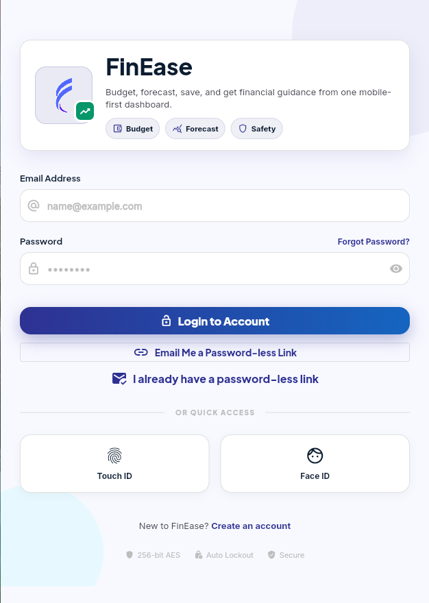 | 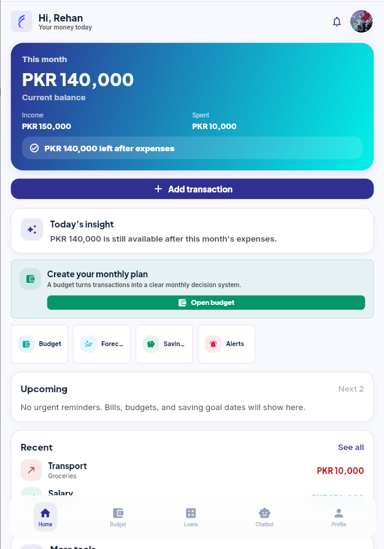 | 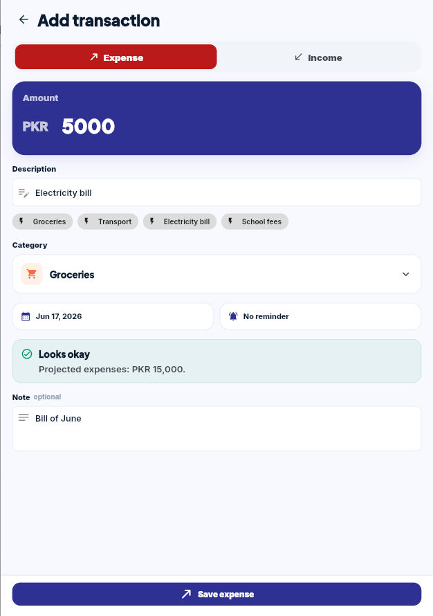 |

| Budget planner | Forecast risk | Savings goals |
|---|---|---|
| 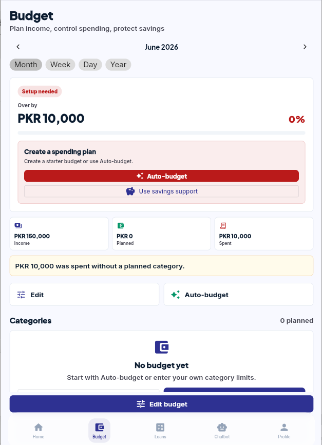 | 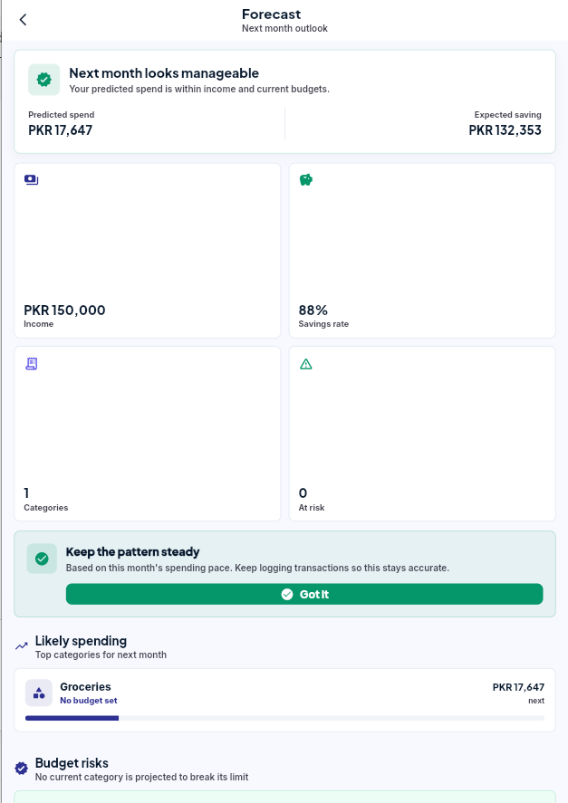 | 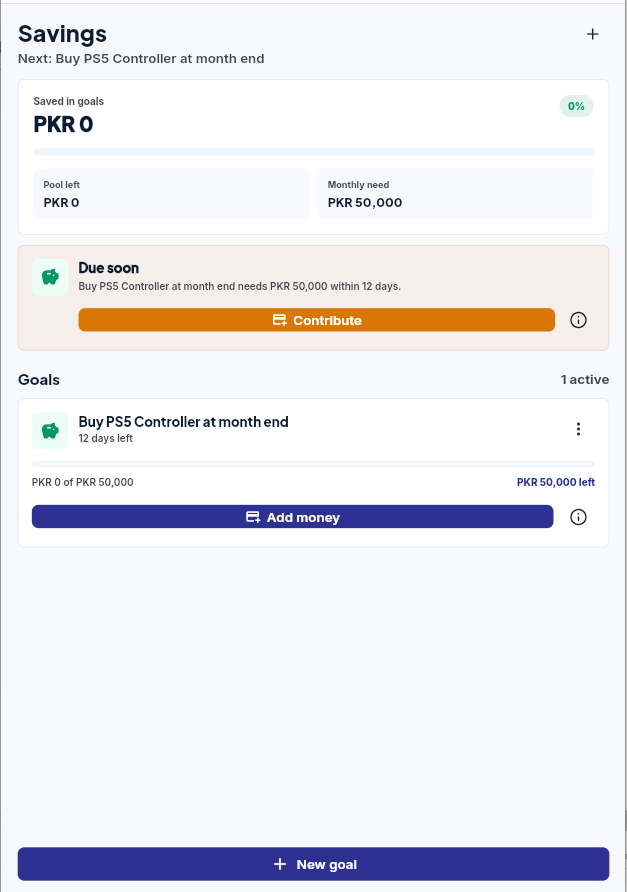 |

| AI coach | Literacy lessons | Welfare support |
|---|---|---|
| 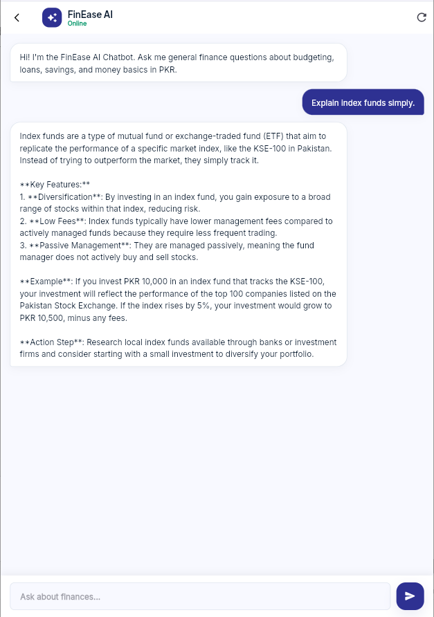 | 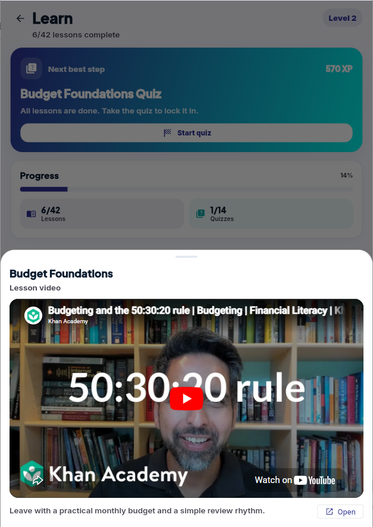 | 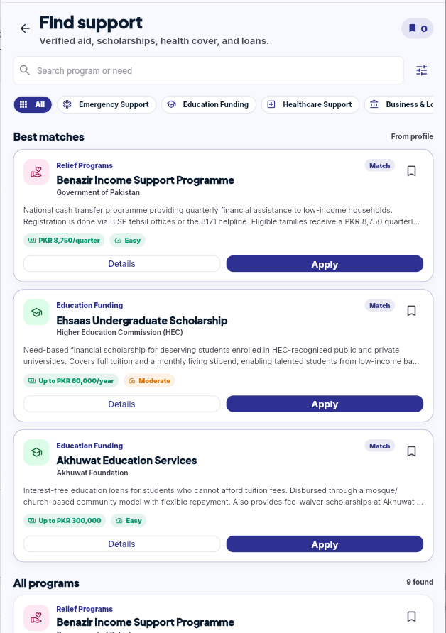 |

| Marketplace | Admin dashboard |
|---|---|
| 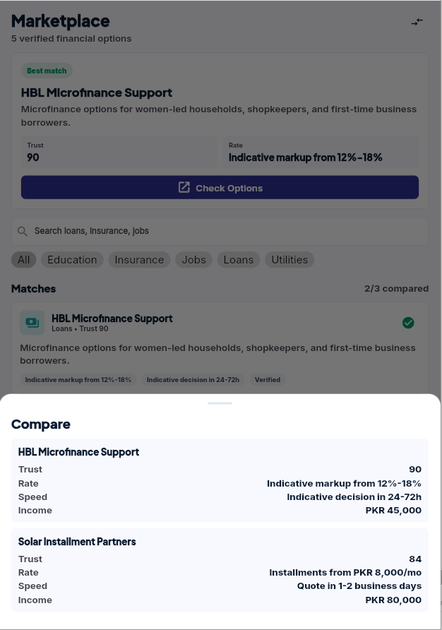 | 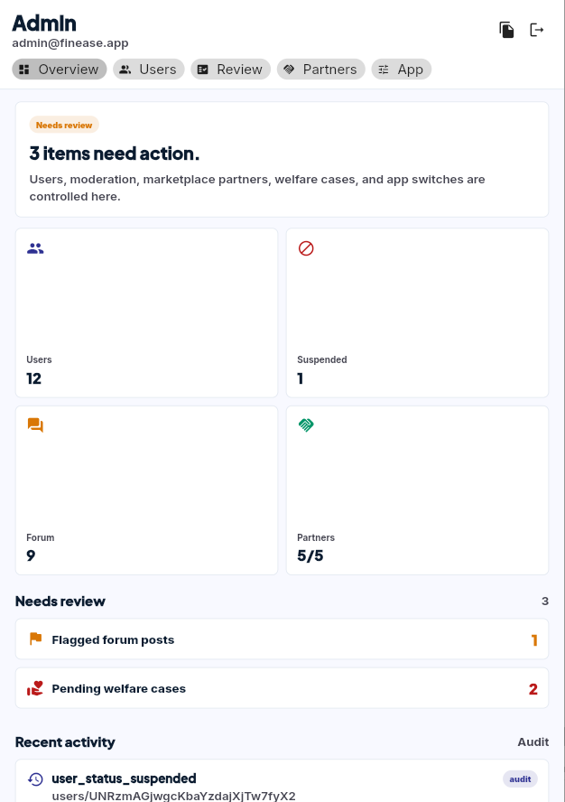 |

## Core Features

- **Authentication and onboarding:** Email login, signup, email verification, biometric-ready login flow, demo access, admin routing, and first-time user guidance.
- **Home dashboard:** A mobile-first summary of income, spending, savings, forecast warnings, budget pressure, and next actions.
- **Transactions:** Add, view, categorize, filter, and delete income or expense records, with backend monthly summary updates.
- **Budget planner:** Create weekly, monthly, yearly, or custom period budgets, compare planned vs spent amounts, detect category risk, and apply recommended budgets.
- **Forecast:** Predicts next-month spending risk from transaction history and shows whether the user is financially safe.
- **Savings:** Tracks goals, progress, contribution needs, debt-oriented goals, and savings actions.
- **Analysis:** Converts transaction data into financial insight, not just charts.
- **Loans:** Helps users reason about affordability, monthly burden, repayment risk, and debt pressure.
- **AI coach and chatbot:** Uses GitHub Models to answer general questions and provide personalized guidance from the user's budgets, transactions, and savings context.
- **Literacy:** Includes lessons, quizzes, progress tracking, and in-app YouTube video learning.
- **Welfare:** Helps users discover support programs, eligibility, required documents, bookmarks, and application status.
- **Marketplace:** Shows partner recommendations, comparison history, trust signals, and lead/event tracking.
- **Forum:** Financial help community with posts, comments, replies, reactions, moderation states, and reputation.
- **Notifications:** Builds alerts from real budget, savings, transaction, forecast, and welfare signals.
- **Admin dashboard:** Platform control for users, partners, forum moderation, welfare review, app configuration, and audit logs.

## Backend and Data

FinEase uses Firebase as the backend:

- **Firebase Authentication** for demo, user, and admin sign-in.
- **Cloud Firestore** for transactions, budgets, savings goals, literacy progress, marketplace state, forum content, welfare state, app configuration, and admin audit logs.
- **Firestore security rules** scoped by authenticated user ownership and admin access.
- **Firebase Hosting** for the deployed Flutter web app.

The final backend smoke test verified authentication and CRUD operations for the main app collections, including transactions, budget plans, savings goals, welfare state, marketplace state, literacy progress, forum posts/comments, admin marketplace records, welfare applications, and audit logs.

## Tech Stack

- Flutter
- Dart
- Firebase Authentication
- Cloud Firestore
- Firebase Hosting
- GitHub Models API
- Provider state management
- Flutter Secure Storage
- Local Auth / biometrics
- YouTube Player IFrame
- FL Chart
- Google Fonts
- URL Launcher
- Image Picker

## Project Structure

```text
lib/
  models/              Data models for finance, forum, marketplace, config
  pages/               App screens and modules
  services/            Firebase, AI, auth, analytics, forecast, and utility services
  theme/               App theme and visual system
  widgets/             Shared UI widgets

assets/
  logo/                App logo

images/
  *.png                README screenshots

functions/
  index.js             Firebase Cloud Functions for admin backend tasks

test/
  *.dart               Unit and widget tests
```

## Running Locally

Install dependencies:

```bash
flutter pub get
```

Run checks:

```bash
flutter analyze
flutter test
```

Run the web app:

```bash
flutter run -d chrome
```

For AI features, set a local environment variable and pass it as a Dart define:

```powershell
[Environment]::SetEnvironmentVariable("MODELS_API_TOKEN", "your_token_here", "User")
flutter run -d chrome --dart-define=MODELS_API_TOKEN=$env:MODELS_API_TOKEN
```

Do not commit API keys or local `.env` files.

## Deployment

Build the web app:

```bash
flutter build web --release
```

Deploy to Firebase Hosting:

```bash
firebase deploy --only hosting --project finease-27a62
```

Deploy Firestore rules:

```bash
firebase deploy --only firestore:rules --project finease-27a62
```

## Contributors

- [Abdul Ahad](https://github.com/aahad699)
- [Rehan Ali Ch](https://github.com/RehanAliCh31)
- [Hafiz Abdullah](https://github.com/Abdullahkhaleeq)

## Status

FinEase is deployed and ready for a recruiter/demo walkthrough. The current version prioritizes mobile usability, functional proof, and a clear financial resilience story.
